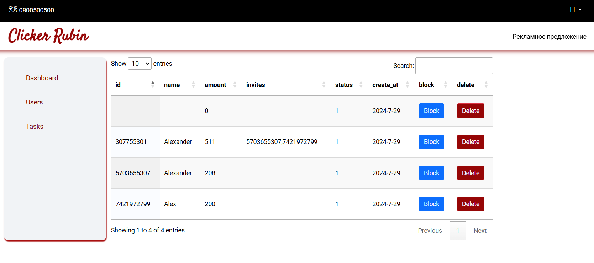

## Игра Clicker Rubin для Telegram

### Описание: Игра таполка для Telegram

### База данных


### Запуск через бота

````
bot.start((ctx) => {
const referral = ctx.payload.length>1?ctx.payload:null;
const id = ctx.from.id.toString();
const get_names = ctx.from.first_name;
const names = get_names.length>1?get_names:"";
ctx.reply(
`Привет, ${ctx.message.from.first_name}! Нажми на кнопку ниже, чтобы начать игру.`,
Markup.inlineKeyboard([
[Markup.button.webApp('Играть', LOCAL_WEB_APP_URL+`/${id}/${get_names}/${referral}`)],
])
);
});
````

## 1. Главная страница


## 2. Список задач


## 3. Реферальная ссылка и список приведенных


## 4. Вознагрождение


## Запуск:
1. 'bot/.env'
````
   BOT_TOKEN=___________________________________________________
   LOCAL_WEB_APP_URL=___________________________________________
````
Указать имя бота и адрес сервера
2. '.env'
````
   ADMIN_EMAIL=admin@admin.ua
   ADMIN_PASSWORD=12345678
   URL_START=____________________________________________________
````
email и password для входа в админ панель
3. 'front/src/config.mjs'
````
   export const config = {
   PATH_URL : '_________________________________________________',
   APP_URL :  '_________________________________________________'
   }
````
````
npm run build
````

### Admin 
http://localhost:5000/admin/login


http://localhost:5000/admin/users


http://localhost:5000/admin/tasks

